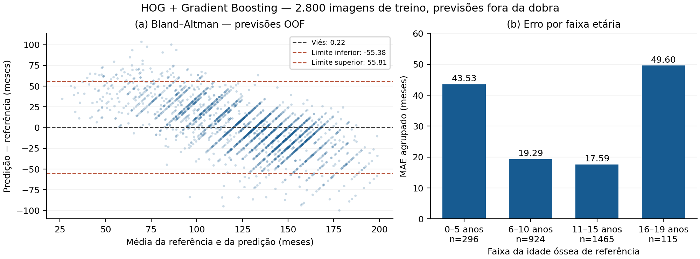
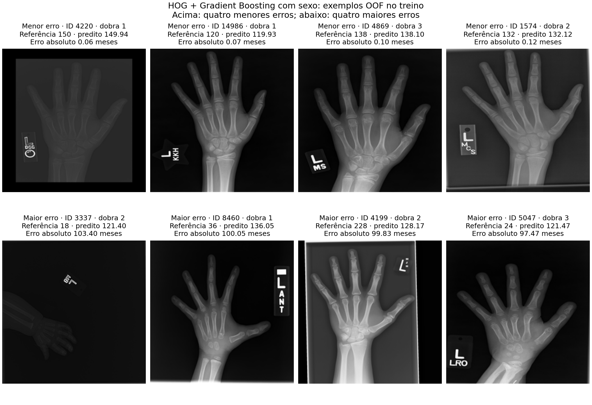

# Baseline de idade óssea pediátrica com descritores manuais e regressores clássicos

Carlos Daniel Reis da Silva · Raul Ferreira Holanda · Rílari Maia Castelo

**RASCUNHO COM RESULTADOS REAIS CONFERIDOS — não submeter nesta versão.** Confirmar afiliação, esclarecer o agrupamento por paciente/exame, consolidar a avaliação final com a equipe, revisar as fontes e adaptar ao template SBC de até quatro páginas. Os resultados abaixo são de validação cruzada interna no treino, não do conjunto de teste. Nenhum resultado sintético foi inserido.

## Resumo

Este trabalho compara descritores manuais e regressores clássicos para estimar idade óssea em radiografias pediátricas. Uma amostra estratificada de 4.000 imagens RSNA foi dividida em treino, validação e teste. Nos 2.800 casos de treino, três dobras por idade e sexo compararam textura, HOG e intensidade, com sexo como covariável. HOG com Gradient Boosting apresentou o menor MAE médio: 22,21 ± 0,85 meses, contra 33,83 ± 0,99 da média do treino. Reduzir a resolução da textura de 224 para 128 pixels aumentou o MAE em 0,73 mês. Os erros foram maiores nas faixas etárias extremas. A comparação é interna ao desenvolvimento, e a ausência de chave de paciente limita a comprovação de independência entre partições.

## Abstract

This work compares handcrafted descriptors and classical regressors for pediatric bone age estimation. A stratified sample of 4,000 RSNA radiographs was divided into training, validation and test sets. Three age-and-sex-stratified folds within the 2,800 training cases compared texture, HOG and intensity representations, with sex as a covariate. HOG with Gradient Boosting achieved the lowest mean MAE: 22.21 ± 0.85 months, versus 33.83 ± 0.99 for the training-mean baseline. Reducing texture resolution from 224 to 128 pixels increased MAE by 0.73 months. Errors were larger at the age extremes. These are internal development results, and the absence of a patient identifier limits verification of independence across partitions.

## 1. Introdução

A estimativa de idade óssea a partir de radiografias de mão constitui a tarefa abordada pelo desafio pediátrico da RSNA de 2017 [1]. Embora a literatura inclua métodos de aprendizado profundo [2], o objetivo deste estudo é estabelecer uma referência com engenharia explícita de características e regressores clássicos. Um baseline desse tipo permite examinar o sinal contido nas representações da imagem e fornece uma comparação documentada para desenvolvimentos posteriores.

Investigamos três famílias complementares: padrões locais e dependências espaciais dos níveis de cinza, distribuição de gradientes e estatísticas de intensidade. As contribuições são: (i) amostra auditada com identificadores congelados; (ii) pré-processamento comum às famílias; e (iii) código de comparação e ablação com rastreamento de IDs e parâmetros. A qualidade dessas comparações depende do protocolo de validação, particularmente da independência entre observações e do ajuste das transformações exclusivamente no treino.

## 2. Trabalhos relacionados

Halabi et al. [1] descrevem o desafio RSNA de idade óssea, enquanto Larson et al. [2] investigam uma abordagem profunda para avaliação da maturidade esquelética. Este último trabalho situa o problema; redes profundas não são usadas no pipeline desta equipe e seus números não constituem comparação direta com nossa amostra.

Para as representações manuais, Haralick et al. [3] descrevem características baseadas em dependências espaciais de tons de cinza. Ojala et al. [4] estudam operadores LBP, e Dalal e Triggs [5] apresentam histogramas de gradientes orientados para detecção humana. Esses trabalhos fundamentam os descritores, mas não demonstram, por si, seu desempenho na tarefa de idade óssea. A transferência para esta tarefa é uma hipótese a avaliar experimentalmente.

Na modelagem, SVR oferece uma formulação de regressão com regularização [6]; Random Forest agrega árvores aleatorizadas [7]; e Gradient Boosting constrói aproximações sequenciais no espaço de funções [8]. Compará-los na mesma amostra evita confundir diferenças de modelo com mudanças de dados. Varma e Simon [9] discutem viés ao selecionar e avaliar modelos pela mesma validação; por isso, resultados de busca e de avaliação devem ser distinguidos. A análise de concordância se apoia em Bland e Altman [10], sem interpretar correlação isolada como concordância clínica.

## 3. Metodologia

### Dados e amostragem

Utilizou-se a versão 2 de `kmader/rsna-bone-age`, com PNGs e rótulos `id`, `boneage` e `male`. A base auditada contém 12.611 imagens, com idades entre 1 e 228 meses; há 5.778 rótulos femininos e 6.833 masculinos. Para limitar o custo computacional, selecionou-se uma amostra estratificada de 4.000 imagens com semente 42. As faixas são [0,72), [72,132), [132,192) e [192,240) meses, combinadas ao sexo. Os IDs foram congelados em treino (2.800), validação (600) e teste (600), sem repetição de IDs de imagem. O pacote de textura foi gerado e conferido contra esses IDs.

Não há chave verificável de paciente nos arquivos usados. Assim, a disjunção de IDs de imagem não comprova independência por paciente. **[Registrar o esclarecimento do professor sobre o protocolo; não afirmar que a partição já atende ao requisito por paciente/exame.]** Todas as divisões são próprias do conjunto público de treino; não se trata do teste oficial sem rótulos do Kaggle.

### Pré-processamento e descritores

As imagens são convertidas para cinza, redimensionadas para 224×224 com Lanczos e normalizadas por divisão por 255. Não há recorte, remoção de fundo ou realce de contraste. A uniformização permite que as famílias utilizem os mesmos pixels; seu impacto na escala dos detalhes é examinado pela ablação de resolução.

A textura contém dez valores do histograma LBP uniforme (oito pontos, raio um) e dez atributos GLCM. A GLCM usa 16 níveis, distâncias um e dois, quatro ângulos (0°,45°,90°,135°), simetria e normalização. Calculam-se média e desvio populacional de contraste, dissimilaridade, homogeneidade, energia e correlação sobre as oito combinações. A intensidade média adicional do extrator foi excluída desta família. O HOG utiliza nove orientações, células 16×16 e blocos 2×2, com 6.084 valores. Intensidade reúne histograma de 32 intervalos, média, desvio e percentis 25,50,75, totalizando 37 valores. O sexo é acrescentado a cada representação.

### Modelos e avaliação interna

A execução real comparou SVR RBF (C=10; epsilon=1), Random Forest (300 árvores) e Gradient Boosting (300 estimadores; profundidade três; learning rate 0,05). Essas configurações são fixas; a busca de hiperparâmetros do SVR é separada e não deve ser apresentada como uma avaliação externa independente. As implementações usam scikit-learn [11].

Foram executadas três dobras estratificadas por idade e sexo dentro dos 2.800 IDs de treino, com semente 42 e tamanhos 934, 933 e 933. O modo por imagem permanece provisório pela ausência da chave de paciente. Cada dobra ajustou o StandardScaler somente no seu treino interno e utilizou a média dos rótulos desse treino como baseline. Reportam-se MAE em meses, RMSE e R² como média e desvio amostral entre dobras. Os 600 IDs de validação externa e os 600 de teste não aparecem nas previsões dessa execução. A comparação entre configurações pela CV é uma etapa de desenvolvimento; o desempenho do candidato escolhido não constitui estimativa externa independente [9].

A ablação executada comparou textura em 224 e 128 pixels, mantendo o modelo Gradient Boosting, a covariável sexo e as mesmas dobras. Ela mede o efeito da resolução no pipeline de textura. O repositório é https://github.com/RaulFH0/tp1-e2-bone-age; o pacote de execução registra IDs, parâmetros, versões e hashes.

## 4. Resultados e discussão

Os resultados reais foram conferidos a partir de 39.200 previsões, com uma predição fora da dobra por ID em cada combinação. IDs, dobras e hashes coincidiram com a execução preparada, e a recomputação reproduziu as métricas registradas. A Tabela 1 mostra média ± desvio amostral entre três dobras, todas no conjunto de treino e com sexo como covariável. A baseline é comum às representações.

| Representação | Modelo | MAE (meses) | RMSE (meses) | R² |
|---|---|---|---|---|
| Baseline comum | Média do treino | 33,83 ± 0,99 | 41,48 ± 0,66 | -0,00 ± 0,00 |
| Textura 224 | SVR | 25,71 ± 0,41 | 33,44 ± 0,19 | 0,35 ± 0,01 |
| Textura 224 | Random Forest | 24,84 ± 0,93 | 32,16 ± 1,10 | 0,40 ± 0,03 |
| Textura 224 | Gradient Boosting | 24,81 ± 0,98 | 32,01 ± 1,34 | 0,40 ± 0,04 |
| HOG | SVR | 28,15 ± 0,89 | 35,37 ± 0,67 | 0,27 ± 0,01 |
| HOG | Random Forest | 26,73 ± 0,99 | 33,25 ± 0,89 | 0,36 ± 0,02 |
| HOG | Gradient Boosting | 22,21 ± 0,85 | 28,35 ± 0,85 | 0,53 ± 0,02 |
| Intensidade | SVR | 28,35 ± 0,74 | 36,69 ± 0,64 | 0,22 ± 0,02 |
| Intensidade | Random Forest | 25,76 ± 1,18 | 33,13 ± 1,60 | 0,36 ± 0,05 |
| Intensidade | Gradient Boosting | 25,95 ± 1,04 | 33,52 ± 1,67 | 0,35 ± 0,05 |
| Textura 128 | Gradient Boosting | 25,54 ± 1,51 | 32,59 ± 1,51 | 0,38 ± 0,04 |

HOG + Gradient Boosting apresentou o menor MAE médio entre as nove configurações: 22,21 ± 0,85 meses, com RMSE de 28,35 ± 0,85 e R² de 0,53 ± 0,02. A redução do MAE em relação à média do treino foi de 34,35%. A classificação é descritiva da comparação interna. Não foi realizado teste de significância entre modelos nem avaliação externa do candidato escolhido nesta execução.

Na ablação, textura + Gradient Boosting em 224×224 produziu MAE de 24,81 ± 0,98 meses, contra 25,54 ± 1,51 em 128×128. A redução da resolução aumentou o MAE em 0,73 mês em média. As diferenças por dobra foram 0,01, 1,28 e 0,91 mês. Assim, 224 pixels apresentou menor erro nas três dobras para esse pipeline, com uma diferença pequena na primeira. O resultado não permite generalizar o efeito da resolução às outras famílias.

Nas 2.800 previsões OOF de HOG + Gradient Boosting, o Bland–Altman descritivo [10], com diferença predito menos referência, apresentou viés de +0,22 mês e limites de média ± 1,96 DP de −55,38 e +55,81 meses. O viés global pequeno não significa erros individuais pequenos. A análise por faixa mostrou MAE agrupado de 43,53 meses em 0–5 anos (n=296), 19,29 em 6–10 (n=924), 17,59 em 11–15 (n=1.465) e 49,60 em 16–19 (n=115). As previsões superestimaram as idades menores e subestimaram as maiores nesta amostra. As faixas extremas tiveram maior erro e menor representação, sem que esta associação estabeleça causalidade.

**Figura 1 — análise de desenvolvimento, não de teste final:** `figura_erro_oof_HOG_GB.pdf`. (a) Bland–Altman das previsões OOF. (b) MAE agrupado por idade de referência e número de observações. A figura evidencia os padrões de erro do candidato escolhido e não estabelece concordância clínica.

A Figura 2 apresenta os quatro menores e os quatro maiores erros absolutos entre as 2.800 previsões OOF de HOG + Gradient Boosting. Os casos 4220, 14986, 4869 e 1574 apresentam erros entre 0,06 e 0,12 mês, todos em idades de referência de 120 a 150 meses. Nos casos de maior erro, 3337, 8460 e 5047, as referências são 18, 36 e 24 meses, com superestimações de 103,40, 100,05 e 97,47 meses; o caso 4199, de 228 meses, é subestimado em 99,83 meses. Esses exemplos ilustram o padrão de compressão das previsões observado na análise por faixa etária.

No caso 3337, a imagem processada apresenta baixa luminosidade visual e a mão deslocada em relação ao centro; os demais casos mostram variações de enquadramento, fundo e marcadores. Como o pipeline não recorta a mão nem remove esses elementos, eles permanecem na representação HOG. As observações motivam hipóteses para avaliações futuras, mas não demonstram que esses fatores causaram os erros. O caso 4220 também aparece escuro e teve erro pequeno, reforçando que aparência visual isolada não explica o desempenho. A seleção pelos extremos do erro é ilustrativa e não constitui amostra aleatória ou diagnóstico clínico.

**Figura 2 — exemplos OOF no treino:** `figura_radiografias_oof_HOG_GB.pdf`. Linha superior: quatro menores erros; linha inferior: quatro maiores erros. Cada imagem foi predita pelo modelo da dobra que não a utilizou no treinamento. As radiografias são apresentadas após o pré-processamento comum de 224×224 pixels, com ID, dobra, referência, previsão e erro em meses. Nenhum desses casos pertence à validação externa ou ao teste. Independência por paciente não verificada.

**[Consolidar com a equipe a avaliação externa existente antes de realizar novo teste.]**

## 5. Conclusão

Na comparação interna entre descritores e regressores clássicos, HOG com Gradient Boosting apresentou o menor MAE médio, reduzindo o erro em 34,35% em relação à média do treino. A ablação de textura favoreceu a resolução 224×224 em relação a 128×128 nas três dobras. Entretanto, os erros maiores nas faixas etárias extremas e os limites de concordância amplos indicam que a média global não resume o comportamento por idade. A amostra de 4.000 imagens, a escolha do candidato pela mesma validação cruzada e a ausência de chave verificável de paciente limitam a generalização. O conjunto de teste permanece preservado nesta execução. A conclusão definitiva depende da consolidação do protocolo e da avaliação externa, sem apresentar o sistema como ferramenta clínica validada.

## Referências iniciais

Metadados e resumos consultados em fontes dos autores, periódicos e editoras. A equipe deve revisar o conteúdo utilizado e a pertinência das citações antes de assinar o artigo. Esta lista não representa uma declaração de leitura integral de todos os trabalhos.

1. Halabi, S. S. et al. (2019). The RSNA Pediatric Bone Age Machine Learning Challenge. *Radiology*, 290(2), 498–503. https://doi.org/10.1148/radiol.2018180736
2. Larson, D. B. et al. (2018). Performance of a Deep-Learning Neural Network Model in Assessing Skeletal Maturity on Pediatric Hand Radiographs. *Radiology*, 287(1), 313–322. https://doi.org/10.1148/radiol.2017170236
3. Haralick, R. M., Shanmugam, K. e Dinstein, I. (1973). Textural Features for Image Classification. *IEEE Transactions on Systems, Man, and Cybernetics*, SMC-3(6), 610–621. https://doi.org/10.1109/TSMC.1973.4309314
4. Ojala, T., Pietikäinen, M. e Mäenpää, T. (2002). Multiresolution Gray-Scale and Rotation Invariant Texture Classification with Local Binary Patterns. *IEEE Transactions on Pattern Analysis and Machine Intelligence*, 24(7), 971–987. https://doi.org/10.1109/TPAMI.2002.1017623
5. Dalal, N. e Triggs, B. (2005). Histograms of Oriented Gradients for Human Detection. *IEEE Computer Society Conference on Computer Vision and Pattern Recognition*, vol. 1, 886–893. https://doi.org/10.1109/CVPR.2005.177
6. Smola, A. J. e Schölkopf, B. (2004). A tutorial on support vector regression. *Statistics and Computing*, 14, 199–222. https://doi.org/10.1023/B:STCO.0000035301.49549.88
7. Breiman, L. (2001). Random Forests. *Machine Learning*, 45, 5–32. https://doi.org/10.1023/A:1010933404324
8. Friedman, J. H. (2001). Greedy function approximation: A gradient boosting machine. *The Annals of Statistics*, 29(5), 1189–1232. https://doi.org/10.1214/aos/1013203451
9. Varma, S. e Simon, R. (2006). Bias in error estimation when using cross-validation for model selection. *BMC Bioinformatics*, 7, 91. https://doi.org/10.1186/1471-2105-7-91
10. Bland, J. M. e Altman, D. G. (1986). Statistical methods for assessing agreement between two methods of clinical measurement. *The Lancet*, 327(8476), 307–310. https://doi.org/10.1016/S0140-6736(86)90837-8
11. Pedregosa, F. et al. (2011). Scikit-learn: Machine Learning in Python. *Journal of Machine Learning Research*, 12, 2825–2830. https://www.jmlr.org/papers/v12/pedregosa11a.html

## Declaração de apoio de IA — revisar com a equipe

Foi utilizada IA generativa como apoio à revisão de código, elaboração de testes e organização/redação inicial do texto. A equipe deve verificar os experimentos, as referências e a redação final e ajustar esta declaração aos usos efetivamente realizados por cada integrante.

## Pendências para a versão de entrega

1. Esclarecer o agrupamento por paciente/exame com o professor; não declarar conformidade antes desse esclarecimento.
2. Consolidar com a equipe a configuração escolhida e a avaliação externa já existente; este pacote verificou CV interna e ablação, não o teste final.
3. Inserir e conferir no documento renderizado as Figuras 1 e 2 fornecidas; as radiografias reais e suas previsões OOF já foram verificadas.
4. Confirmar afiliação e contribuição individual e revisar referências/declaracão de IA em equipe.
5. Adaptar e conferir no template SBC: até quatro páginas, até dez linhas em cada resumo, fontes/PDF e contribuição assinada conforme a atividade. Não alegar conformidade de páginas antes de renderizar o documento completo.
